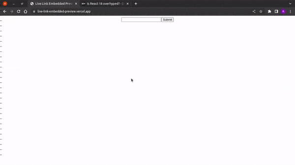

# Live Link Embedded Preview

Generate link preview as you see on social platforms. Right in the browser without processing at backend.


## Usage/Examples



## Setup

```bash
  git clone https://github.com/TheRakeshPurohit/live-link-embedded-preview.git
  cd live-link-embedded-preview
  npm i 
  npm start --reset-cache
```

## CORS Error

To avoid CORS errors, I have used CORS-ANYWHERE.

If you face the same, go to this [link](cors-anywhere.herokuapp.com/corsdemo)

Click on `"Request temporary access to the demo server"` button

## Authors

- [@TheRakeshPurohit](https://www.github.com/therakeshpurohit)

### MIT Licensed
